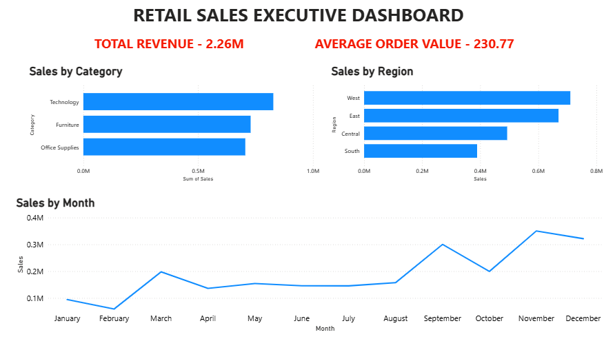
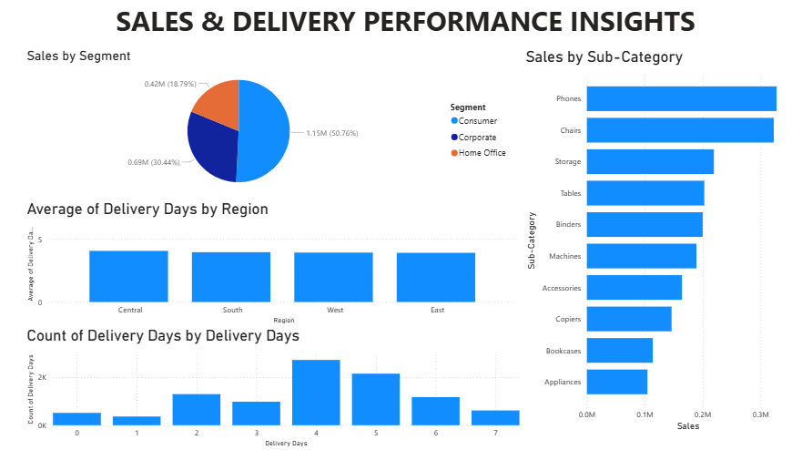

# Retail Sales Intelligence Analysis

## Project Overview
This project analyzes retail sales data to identify revenue trends, product performance, regional insights, customer segmentation patterns, and operational efficiency.

The objective was to extract actionable business insights using Python-based data analysis techniques.

---

## Dataset Information
- Total Records: 9,800
- Time Period: 2015–2018
- Features: Order details, customer data, product category, region, sales, and shipping information.

---

## Key Business Insights

- Total Revenue generated: ~2.26 Million
- Strong revenue growth observed in 2017 and 2018.
- Technology category and Phones sub-category were top revenue drivers.
- West region generated the highest revenue; South underperformed.
- Average delivery time: ~4 days (consistent across regions).
- Consumer segment contributed majority of revenue.
- Revenue distribution is diversified with low customer concentration risk.

---

## Tools & Technologies Used
- Python
- Pandas
- Matplotlib
- Jupyter Notebook

---

## Skills Demonstrated
- Data Cleaning & Transformation
- Exploratory Data Analysis (EDA)
- KPI Computation
- Time Series Analysis
- Customer Segmentation
- Business Insight Generation
- Operational Efficiency Analysis

---

## Power BI Dashboard

### Executive Overview

### Detailed Insights

